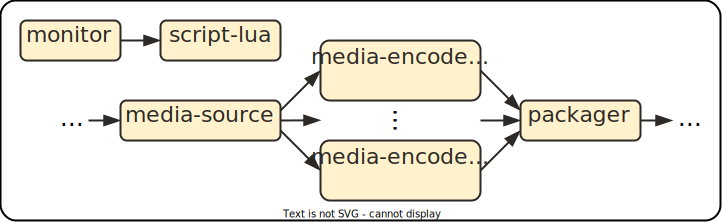

# MMSys 2025 Example: Towards Self-Adapting MPEG NBMP Multimedia Workflows

This example demonstrates a self-adapting NBMP workflow. HTTP adaptive streaming (HAS) is taken as use case. Based on simulated statistics about retrieved renditions the workflow self-adapts by changing what renditions are encoded.

The NBMP workflow consists of the following tasks. `monitor` simulates viewer statistics and outputs them as JSON data to a metadata stream. Here, we use a `script-lua` function to implement the simulation. Next, the `script-lua` task also runs a `script-lua` function and implements the monitor, analyze, plan, execute and knowledge (MAPE-K) adaptation loop. The media stream traverses the following tasks. For the purpose of this example, it originates from the `media-source` task. After that, various `media-encode` tasks create renditions of the media stream in different resolutions and bitrates. Finally, the stream is sent to the `packager` task. In this case, the `packager` task simply discards the media stream and does not really package it for HAS.



## `monitor` Task

The `monitor` task simulates viewer statistics for each HAS rendition. It outputs a JSON document to the `stats` output port every 2 minutes. The following script was used (with varying `data` tables):

```lua
data = {
  "{\"2160p-10\": 100, \"1440-7\": 100, \"1080-6\": 100, \"720p-3\": 100, \"480-1-5\": 100, \"360-1\": 100, \"240p-0-5\": 100}",
  "{\"2160p-10\":   0, \"1440-7\":   0, \"1080-6\":   0, \"720p-3\":   0, \"480-1-5\":   0, \"360-1\":   0, \"240p-0-5\":   0}",
  "{\"2160p-10\": 100, \"1440-7\": 100, \"1080-6\": 100, \"720p-3\": 100, \"480-1-5\": 100, \"360-1\": 100, \"240p-0-5\": 100}",
  "{\"2160p-10\":   0, \"1440-7\":   0, \"1080-6\":   0, \"720p-3\":   0, \"480-1-5\":   0, \"360-1\":   0, \"240p-0-5\":   0}",
  "{\"2160p-10\": 100, \"1440-7\": 100, \"1080-6\": 100, \"720p-3\": 100, \"480-1-5\": 100, \"360-1\": 100, \"240p-0-5\": 100}",
  "{\"2160p-10\":   0, \"1440-7\":   0, \"1080-6\":   0, \"720p-3\":   0, \"480-1-5\":   0, \"360-1\":   0, \"240p-0-5\":   0}",
}

stats_port = nme.get_output_port("stats")

for _, stats in ipairs(data) do
  stats_port:write_line(stats)
  nme.sleep("2m")
end

stats_port:close()
```

## `script-lua` Task

The `script-lua` task receives the monitoring statistics and adapts the workflow based on the encoding ladder policy. The following script was used:

```lua
-- knowledge
wf         = nbmp.Workflow:self()
src_task   = wf:get_task("media-source")
pkg_task   = wf:get_task("packager")
stats_port = nme.get_input_port("stats")
enc_ladder = {
  ["2160p-10"]  = { r = "3840x2160"; b = "10000"; min = 20},
  [ "1440-7"]   = { r = "2560x1440"; b =  "7000"; min = 10},
  [ "1080-6"]   = { r = "1920x1080"; b =  "6000"; min = 10},
  [ "720p-3"]   = { r = "1280x720";  b =  "3000"; min =  5},
  [  "480-1-5"] = { r =  "854x480";  b =  "1500"; min =  5},
  [  "360-1"]   = { r =  "640x360";  b =  "1000"; min =  1},
  [ "240p-0-5"] = { r =  "426x240";  b =   "500"; min =  0}
}

while true do
  -- analyze
  stats_data = stats_port:read_line()
  if not stats_data then
    break
  end

  stats = json.parse(stats_data)
  for enc, ladder in pairs(enc_ladder) do
    enc_task = nbmp.Task:new({
      id = "encode-"..enc,
      function_restriction = {
        id = "ClusterFunction/media-encode",
        config = {
          ["media-encode.engine.nagare.media/resolution"] = ladder.r,
          ["media-encode.engine.nagare.media/bitrate"]    = ladder.b,
        }
      }
    })

    con_media = nbmp.Connection:new({
      id   = src_task.id.." --> "..enc_task.id,
      from = {task = src_task; port = "out."..enc},
      to   = {task = enc_task; port = "in"}
    })

    con_pkg = nbmp.Connection:new({
      id   = enc_task.id.." --> "..pkg_task.id,
      from = {task = enc_task; port = "out"},
      to   = {task = pkg_task; port = "in-"..enc}
    })

    -- plan
    if ladder.min <= stats[enc] then
      nme.log("add encoding "..enc)
      wf:add_connection(con_media)
      wf:add_connection(con_pkg)
    else
      nme.log("remove encoding "..enc)
      wf:remove_connection(con_media)
      wf:remove_connection(con_pkg)
    end
  end

  -- execute
  nme.log("apply changes")
  wf:update()
end
```

## Host Environment

To run the examples, following additional software must be installed on the host system. Alternatively, only Docker needs to be installed, and all other software is installed through a container:

* **Docker**
* **`git`**
* `sh` (UNIX shell) *(optional if using Docker-only)*
* `bash` *(optional if using Docker-only)*
* `curl` *(optional if using Docker-only)*
* `make` *(optional if using Docker-only)*
* `kind` *(optional if using Docker-only)*
* `kubectl` *(optional if using Docker-only)*
* `helm` *(optional if using Docker-only)*

Clone this repository to the host environment:

```sh
$ git clone https://github.com/nagare-media/engine.git
$ cd engine
$ git checkout mmsys-2025
```

### Docker-only Environment

When using a host environment with only Docker installed, first create a container environment with the necessary software to follow this guide:

```sh
# create kind network; ignore if it already exist
$ docker network create \
    --driver bridge \
    --ipv6 --subnet fc00:f853:ccd:e793::/64 \
    --opt com.docker.network.bridge.enable_ip_masquerade=true \
    --opt com.docker.network.driver.mtu=65535 \
    kind

$ docker run --rm -it --privileged \
    --name nagare-media-engine-test-env \
    --network kind \
    -v "/var/run/docker.sock:/var/run/docker.sock" \
    -v "$PWD:/src" \
    -w /src \
    docker.io/library/alpine:edge

# within the container:

# install necessary tools
docker$ echo "https://dl-cdn.alpinelinux.org/alpine/edge/testing" >> /etc/apk/repositories
docker$ apk add \
          bash \
          curl \
          docker-cli \
          git \
          helm \
          kind \
          kubectl \
          make

# continue with the guide
docker$ ...

# exit (with automatic cleanup after the guide)
docker$ exit
```

## Create Kubernetes Cluster

```sh
$ make kind-up
```

## Deploy `nagare media engine`

Run the following to deploy `nagare media engine`, media functions as well as a media processing entity (MPE):

```sh
$ kubectl create -f docs/mmsys-2025-example-self-adaptation/nagare-all.yaml
$ kubectl wait deployment/workflow-manager -n nagare-media-engine-system --for=condition=available --timeout=-1s
$ kubectl create -f docs/mmsys-2025-example-self-adaptation/nagare-functions.yaml
$ kubectl create -f docs/mmsys-2025-example-self-adaptation/nagare-mpe.yaml
```

## Run Example Workflows

The following three example workflows were implemented:

| Name                                             | Description                                                                              |
| ------------------------------------------------ | ---------------------------------------------------------------------------------------- |
| [`01-minimal-ladder.wdd`](01-minimal-ladder.wdd) | Reports zero viewers for all renditions in every report (lower bound).                   |
| [`02-maximal-ladder.wdd`](02-maximal-ladder.wdd) | Reports many viewers for all renditions in every report (upper bound).                   |
| [`03-adaptation.wdd`](03-adaptation.wdd)         | Alternate the report between zero and many viewers for all renditions (self-adaptation). |

```sh
# forward NBMP Gateway port in the background
$ kubectl port-forward services/gateway-nbmp -n nagare-media-engine-system --address=127.0.0.1 8080:8080 &
```

### `01-minimal-ladder.wdd`

```sh
# create workflow
$ curl \
    -X POST \
    -H "content-type: application/mpeg-nbmp-wdd+json" \
    http://engine.nagare.localtest.me:8080/v2/workflows \
    --data-binary "@docs/mmsys-2025-example-self-adaptation/01-minimal-ladder.wdd"

# observe created NBMP resources
$ kubectl get nme

# delete workflow (after input-buffer task is finished ~ 12 min.)
$ kubectl wait --timeout=-1s --for=condition=complete task input-buffer
$ curl -X DELETE http://engine.nagare.localtest.me:8080/v2/workflows/d08b10de-ea8e-422f-be57-9d32e3082765
```

### `02-maximal-ladder.wdd`

```sh
# create workflow
$ curl \
    -X POST \
    -H "content-type: application/mpeg-nbmp-wdd+json" \
    http://engine.nagare.localtest.me:8080/v2/workflows \
    --data-binary "@docs/mmsys-2025-example-self-adaptation/02-maximal-ladder.wdd"

# observe created NBMP resources
$ kubectl get nme

# delete workflow (after input-buffer task is finished ~ 12 min.)
$ kubectl wait --timeout=-1s --for=condition=complete task input-buffer
$ curl -X DELETE http://engine.nagare.localtest.me:8080/v2/workflows/d08b10de-ea8e-422f-be57-9d32e3082765
```

### `03-adaptation.wdd`

```sh
# create workflow
$ curl \
    -X POST \
    -H "content-type: application/mpeg-nbmp-wdd+json" \
    http://engine.nagare.localtest.me:8080/v2/workflows \
    --data-binary "@docs/mmsys-2025-example-self-adaptation/03-adaptation.wdd"

# observe created NBMP resources
$ kubectl get nme

# delete workflow (after input-buffer task is finished ~ 12 min.)
$ kubectl wait --timeout=-1s --for=condition=complete task input-buffer
$ curl -X DELETE http://engine.nagare.localtest.me:8080/v2/workflows/d08b10de-ea8e-422f-be57-9d32e3082765
```

## Delete Kubernetes Cluster

```sh
$ make kind-down
```
